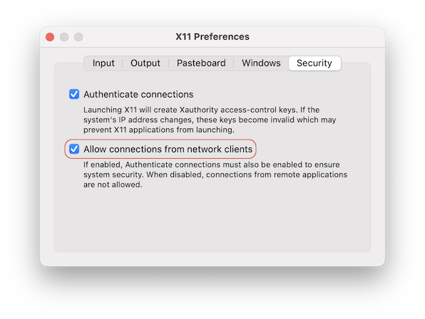
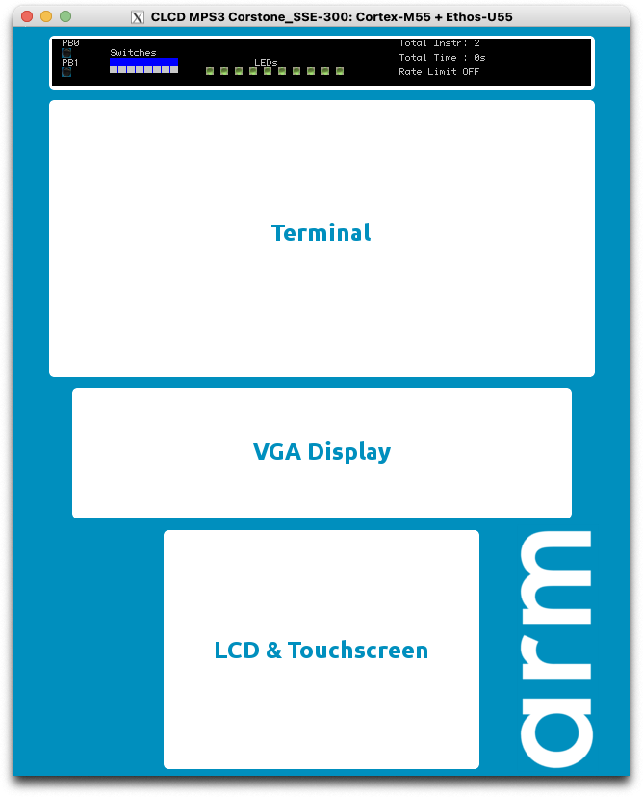

# Running Arm Virtual Hardware FVPs on MacOS

This repository contains scripts that enable Arm Virtual Hardware FVPs to run via Docker on MacOS.

## Prerequisites

[Install Docker Desktop on Mac](https://docs.docker.com/desktop/install/mac-install/).

For commercial use you might require a paid subscription.

Verify proper installation by running the following commands on a terminal:

```sh
docker info
```

If the Docker installation is operational it prints out version information about Client and Server.

## Clone the repo

Open a terminal and set the working directory where to store the Fast Model wrapper to. Then run:

```sh
git clone https://github.com/Arm-Examples/FVPs-on-Mac.git
```

This will create the subdirectory `FVPs-on-Mac` in the current working directory.

## Build the Docker wrapper

Run the build script to create the Docker image and populate the `bin` folder with model wrappers:

```sh
./build.sh
```

Once this succeeds inspect the created `bin` folder containing a bunch of symlinks to `fvp.sh`.
These wrappers can be used exactly like any native model executable:

```sh
./bin/FVP_MPS2_Cortex-M3 --version
```

## Expose models to local environment

Add `$(pwd)/FVPs-on-Mac/bin` to `PATH` environment:

```sh
export PATH=$PATH:$(pwd)/FVPs-on-Mac/bin
```

Put this to our `~/.zshrc` to make it permanent.

## [XQuartz](https://www.xquartz.org/) setup for FVP GUI (optional)

If you want to use the FVP GUI, you need to follow some additional steps on your host OS.

1.  Install XQuartz

        brew install xquartz

1.  Ensure XQuartz allows connections from network clients

    

1.  Allow X11 forwarding

        xhost +

    If you need to set up a socat relay to forward X11 display traffic in a Colima + Docker environment, be sure to allow connections from localhost to ensure proper communication with your XQuartz server.
    ```sh
    xhost + 127.0.0.1
    #install and setup socat relay
    brew install socat
    socat TCP-LISTEN:6000,reuseaddr,fork UNIX-CLIENT:\"$DISPLAY\"
    ```

1.  Run model and check GUI is showing

        FVP_Corstone_SSE-300_Ethos-U55

    If you need to forward display traffic to your Mac, pass your IP address using the `--display-ip` command-line parameter. You can obtain your ip by calling `ipconfig getifaddr en0`.

        FVP_Corstone_SSE-300_Ethos-U55 --display-ip 0.1.2.3

    

#### Resources

- [sorny/x11_forwarding_macos_docker.md](https://gist.github.com/sorny/969fe55d85c9b0035b0109a31cbcb088)

## Run Models

Once the setup has been completed one can run Fast Models as they are installed natively.

Some restrictions still apply:

- By default, only the current working directory is mounted into the Docker container. Hence, all files
    accessed (application images, configuration files) must be stored in the current working directory
    or its subdirectories, unless you specify a different mount directory using `FVP_MOUNT_DIR`.

- Fast Models require an activated User Based License. The license cache stored in `~/.armlm` on the host machine
    is always mapped into the container. Thus, the models running inside of the container reuse the
    license activated on the host machine.

## Customization

The Fast Model version and package used for creating the Docker image and wrapper scripts
is configured in the file `fvprc`. If one wants to use another model version or custom package
one can just change the values stored in this file.

Alternatively, on can set the model version for example as an environment variable overwriting
the default given in `fvprc`. The following settings can be changed:

- *FVP_VERSION*: The release version triple (major.minor.patch).
- *FVP_BASE_URL*: The base download URL to get the model package from.
- *FVP_ARCHIVE*: The name of the model package archive to fetch.

The download URL is composed as `${FVP_BASE_URL}/${FVP_VERSION}/${FVP_ARCHIVE}`.
The created Docker image is labeled as `fvp:${FVP_VERSION}`. Hence, one can keep multiple versions
in parallel and switch between them by just setting the environment variable to the required version.

```sh
FVP_VERSION=11.22.39 FVP_MPS2_Cortex-M3 --version
```

## Repository structure

The repository contains the following files:

```txt
    📦
    ┣ 📂 bin           Created/updated by build.sh script
    ┣ 📄 build.sh      The script to build a Docker image
    ┣ 📄 dockerfile    The recipe used to build the Docker image
    ┣ 📄 fvp.sh        The wrapper script to launch a model executable inside a Docker container
    ┗ 📄 fvprc         The configuration file to customize default model version and package
```

## Customising mount behaviour

The script will always mount `~/.armlm/` inside the container in order to have access to licenses granted on your host. 

By default, the current working directory is mounted in the container, providing read/write access to files in that directory and its subdirectories.

### Mounting a specific directory

If you want to mount a different directory instead of the current working directory, set the `FVP_MOUNT_DIR` environment variable:

```sh
# Mount a specific directory
export FVP_MOUNT_DIR=/Users/someone/my-project/
# - or -
# Mount a specific directory for a single command
FVP_MOUNT_DIR=/Users/someone/my-project/ FVP_MPS2_Cortex-M3 --version
```

### Setting the working directory

By default, the working directory inside the container is set to the mounted directory. You can override this with the `FVP_WORKDIR` environment variable:

```sh
# Set a different working directory inside the container
export FVP_WORKDIR=/path/to/workdir
# - or -
# Set working directory for a single command
FVP_WORKDIR=/path/to/workdir FVP_MPS2_Cortex-M3 --version
```

