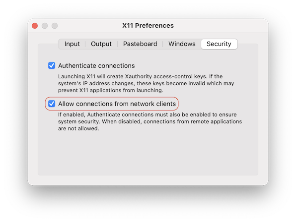
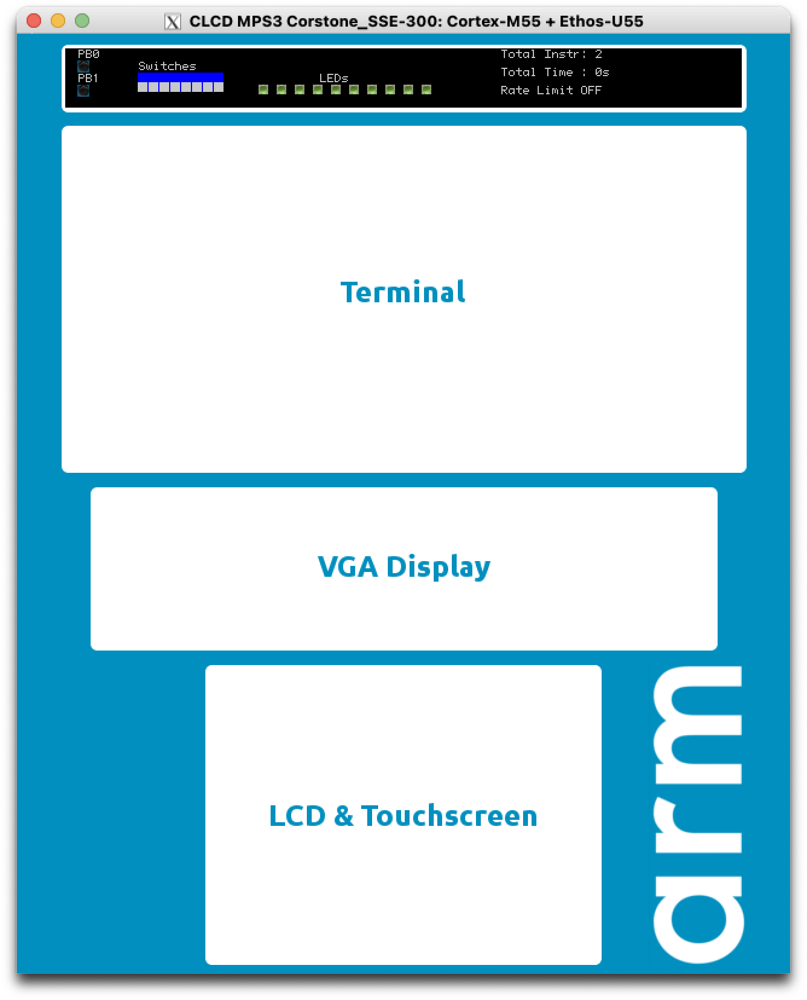

# Running Arm Virtual Hardware FVPs on MacOS

This repository contains scripts that enable Arm Virtual Hardware FVPs to run via Docker on MacOS.

## Prerequisites

[Install Docker Desktop on Mac](https://docs.docker.com/desktop/install/mac-install/).

For commercial use you might require a paid subscription.

Verify proper installation by running the following commands on a terminal:

```sh
docker info
```

If the Docker installation is operational it prints out version information about Client and Server.

## Clone the repo

Open a terminal and set the working directory where to store the Fast Model wrapper to. Then run:

```sh
git clone https://github.com/Arm-Examples/FVPs-on-Mac.git
```

This will create the subdirectory `FVPs-on-Mac` in the current working directory.

## Build the Docker wrapper

This checkout is configured to download and build the official Fast Models
11.32.23 release from `https://artifacts.tools.arm.com/avh/11.32.23/`.
The build selects the Linux Arm64 archive on Apple Silicon and the Linux x86
archive on Intel hosts, then verifies the published SHA-256 checksum.

Run the build script to create the Docker image and populate the `bin` folder with model wrappers:

```sh
./build.sh
```

Once this succeeds inspect the created `bin` folder containing a bunch of symlinks to `fvp.sh`.
These wrappers can be used exactly like any native model executable:

```sh
./bin/FVP_MPS2_Cortex-M3 --version
```

## Expose models to local environment

Add `$(pwd)/FVPs-on-Mac/bin` to `PATH` environment:

```sh
export PATH=$PATH:$(pwd)/FVPs-on-Mac/bin
```

Put this to our `~/.zshrc` to make it permanent.

## [XQuartz](https://www.xquartz.org/) setup for FVP GUI (optional)

If you want to use the FVP GUI, you need to follow some additional steps on your host OS.

1.  Install XQuartz

    ```sh
    brew install xquartz
    ```

    The X11 tools should be installed in `/opt/X11/bin`. Add this directory to your `PATH`.

1.  Ensure XQuartz allows connections from network clients

    Open Xquartz. At the top left of the screen you will find the app's menu bar. Click on **Xquartz - Settings** and go to the **Security** tab: 

    

1.  Allow X11 forwarding

        xhost +

    If you need to set up a socat relay to forward X11 display traffic in a Colima + Docker environment, be sure to allow connections from localhost to ensure proper communication with your XQuartz server.
    ```sh
    xhost + 127.0.0.1
    #install and setup socat relay
    brew install socat
    socat TCP-LISTEN:6000,reuseaddr,fork UNIX-CLIENT:\"$DISPLAY\"
    ```

1.  Run model and check GUI is showing

        FVP_Corstone_SSE-300_Ethos-U55

    If you need to forward display traffic to your Mac, pass your IP address using the `--display-ip` command-line parameter. You can obtain your ip by calling `ipconfig getifaddr en0`.

        FVP_Corstone_SSE-300_Ethos-U55 --display-ip 0.1.2.3

    

#### Resources

- [sorny/x11_forwarding_macos_docker.md](https://gist.github.com/sorny/969fe55d85c9b0035b0109a31cbcb088)

## Run Models

Once the setup has been completed one can run Fast Models as they are installed natively.

Some restrictions still apply:

- By default, your home directory is mounted into the Docker container for file access. Hence, all files
    accessed (application images, configuration files) must be stored in your home directory
    or its subdirectories, unless you specify a different mount directory using `FVP_MOUNT_DIR`.

- Fast Models require an activated User Based License. The license cache stored in `~/.armlm` on the host machine
    is always mapped into the container. Thus, the models running inside of the container reuse the
    license activated on the host machine.

> [!NOTE]
> - If you do not wish to use the GUI, disable it with `fvp_mps2.mps2_visualisation.disable-visualisation=1` in the FVP configuration text file.
> - If you are using a UART and want to redirect to the Terminal, add `fvp_mps2.UART0.out_file=-` to the FVP configuration text file.
> - If you want to disable the Telnet session, add `fvp_mps2.telnetterminal0.start_telnet=0` to the FVP configuration text file.
> - Depending on your model, the prefix `fvp_mps2` might be different!

## CMSIS-Debugger integration

This checkout extends the wrapper to support the CMSIS-Debugger VS Code
extension through the `GDBServer.so` plugin included in the FVP package.

The resulting connection paths are:

```text
CMSIS-Debugger     -> 127.0.0.1:<gdb-port>  -> Docker -> GDBServer.so -> FVP target
CMSIS UART client  -> 127.0.0.1:<uart-port> -> Docker -> telnetterminal<n>
```

CMSIS-Debugger can start any generated FVP wrapper through a `gdbtarget`
configuration and pass the plugin path of `GDBServer.so` through the macOS
`AVH_FVP_PLUGINS` environment variable. The following generic launch.json pattern shows
the relevant settings:

```jsonc
"target": {
    "server": "<FVP-wrapper-name>",
    "serverParameters": [
        "-D",
        "--plugin",
        "${env:AVH_FVP_PLUGINS}/GDBServer.so",
        "-C",
        "GDBServer.port=<gdb-port>",
        "-C",
        "GDBServer.allow_remote=1",
        "-C",
        "GDBServer.shutdown_on_disconnect=1",
        "-a",
        "<path-to-application-image>"
    ],
    "port": "<gdb-port>",
    "serverStartupDelay": 1000,
    "uart": {
        "socketPort": "<uart-port>",
        "eolCharacter": "CRLF"
    }
}
```

Set the value for `gdb-port`, `path-to-application-image`, `uart-port`.

VS Code expands `${env:AVH_FVP_PLUGINS}` in the macOS process before the
Docker wrapper starts. The `ENV AVH_FVP_PLUGINS` instruction in the image does
not set this macOS variable. To use the plugin bundled with the active FVP
image, set the host variable to its in-container directory:

```sh
export AVH_FVP_PLUGINS=/opt/avh-fvp/plugins
```

Although `/opt/avh-fvp/plugins` is not a macOS directory, the expanded string
is forwarded as an FVP argument and becomes valid inside the container.

It is important to disable any Fast Models selection in vcpkg-configuration.json of your CMSIS Solution project. Otherwise, the environment setting for the `GDBServer.so` plugin will be overwritten.

The example launch.json above uses a fixed 1000 ms server startup delay to avoid the GDB connection timeout issue and configures the integrated UART client for raw mode with CRLF line endings. 

### Container cleanup and port reuse

`GDBServer.shutdown_on_disconnect=1` requests graceful plugin shutdown. When VS Code stops or interrupts the server
process, the wrapper's traps identify and remove the exact container created by
that invocation. This prevents a stopped debug session from leaving a container
that still owns the configured GDB or UART port and blocks the next session.

During a live session, inspect the selected image and published ports with:

```sh
docker ps --format 'container={{.Names}} image={{.Image}} ports={{.Ports}}'
```

### FVP UART redirect
If you need to redirect e.g. `printf()` output via FVP UART interface, configure the UART port in a `FVP_Config.txt` to use the same `uart-port` value set in the launch.json file, e.g.
```
mps3_board.telnetterminal0.start_port=<uart-port>
mps3_board.telnetterminal0.mode=raw
```

> [!NOTE]
> The wrapper decides which container ports to publish by scanning its own command line.
> A `telnetterminal<n>.start_port` that is set **only** in the config file configures the
> model correctly but leaves the port unpublished. Pass it on the command line as well
> (`-C mps3_board.telnetterminal0.start_port=<uart-port>`) if a host UART client has to reach it.

## Setup guide for coding agents

[`skills/fvp-debug-setup/`](skills/fvp-debug-setup/) contains a task-focused
setup guide for wiring the CMSIS Solution extension's **Load & Debug** and
**Run** buttons to a model started through this wrapper. It documents the
`GDBServer.so` parameters that matter, how the extension maps its buttons to
launch configs and tasks, the `debugger:` node to add to the csolution file,
the readiness handshake that otherwise makes GDB connect before the model is
listening, and the argument forms this wrapper needs in order to publish the
GDB and UART ports.

It is plain Markdown with a small YAML header, written to be consumed by any
coding agent — or read directly, as documentation.

```txt
    📂 skills/fvp-debug-setup
    ┣ 📄 SKILL.md           The setup guide
    ┗ 📄 verify-launch.py   Replays the debug adapter's launch path against a project's launch.json
```

To make it available to an agent, either point the agent at the file path, or
install it where that agent looks for reusable instructions — for example:

```sh
# Agents that discover skill directories (e.g. Claude Code)
ln -s "$(pwd)/skills/fvp-debug-setup" ~/.claude/skills/fvp-debug-setup

# Agents that read a project instruction file (e.g. Codex, via AGENTS.md)
echo "For FVP debug setup, follow $(pwd)/skills/fvp-debug-setup/SKILL.md" >> AGENTS.md
```

`verify-launch.py` is useful on its own. Run it from a csolution workspace
folder to check that a debug session really comes up — it spawns the model
exactly as the debug adapter would, waits the same way, attaches
`arm-none-eabi-gdb`, and fails if a container is left behind:

```sh
python3 /path/to/FVPs-on-Mac/skills/fvp-debug-setup/verify-launch.py
```

## Customization

The Fast Model version and package used for creating the Docker image and wrapper scripts
is configured in the file `fvprc`. If one wants to use another model version or custom package
one can just change the values stored in this file.

Alternatively, one can set the model version for example as an environment variable overwriting
the default given in `fvprc`. The following settings can be changed:

- *FVP_VERSION*: The release version triple (major.minor.patch).
- *FVP_BASE_URL*: The base download URL for the model package.
- *FVP_ARCHIVE*: The architecture-specific model package archive.
- *FVP_SHA256*: The published SHA-256 checksum for that archive.

The created Docker image is labeled as `fvp:${FVP_VERSION}`. Hence, one can keep multiple versions
in parallel and switch between them by just setting the environment variable to the required version.

```sh
FVP_VERSION=11.32.23 FVP_MPS2_Cortex-M3 --version
```

## Repository structure

The repository contains the following files:

```txt
    📦
    ┣ 📂 bin           Created/updated by build.sh script
    ┣ 📂 skills        Setup guides for coding agents
    ┣ 📄 build.sh      The script to build a Docker image
    ┣ 📄 dockerfile    The recipe used to build the Docker image
    ┣ 📄 fvp.sh        The wrapper script to launch a model executable inside a Docker container
    ┗ 📄 fvprc         The configuration file to customize default model version and package
```

## Customising Docker Mounts

By default, your entire home directory is mounted and the container starts in your current working directory.

For better security and performance, use the `FVP_MOUNT_DIR` and `FVP_WORKDIR` ENV vars limit what's mounted:

```sh
# Mount only current directory
FVP_MOUNT_DIR=$(pwd) FVP_MPS2_Cortex-M3 --version

# Mount project root but work in subdirectory
FVP_MOUNT_DIR=/path/to/project FVP_WORKDIR=/path/to/project/build FVP_MPS2_Cortex-M3 --version
```
